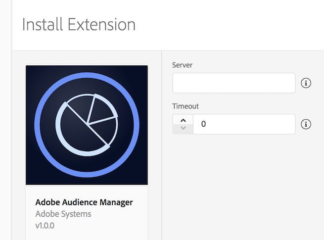

# Adobe Audience Manager

Adobe Audience Manager is a versatile audience data management platform. With the SDK, you can update audience profiles for users and retrieve user segment information from your mobile app. For more information, see [Adobe Audience Manager](https://business.adobe.com/products/audience-manager/adobe-audience-manager.html).

## Configuring the Audience Manager extension in the Data Collection UI



1. In the Data Collection UI, select the **Extensions** tab.
2. Choose **Catalog**, locate the **Adobe Audience Manager** extension, and select **Install**.
3. Type your Audience Manager server.
4. Type a timeout value. This value is the period, in seconds, to wait for a response from Audience Manager before timing out. For best practices, you should use a default value of 2s.
5. Select **Save**.
6. Follow the publishing process to update the SDK configuration.

## Add Audience Manager to your app

The Audience Manager extension depends on the Core and Identity extensions:
* [Mobile Core](https://github.com/adobe/aepsdk-core-android)
* [Identity](https://github.com/adobe/aepsdk-core-android)

1. Add the Mobile Core, Identity, and Audience extensions to your project using the app's Gradle file:

```
implementation 'com.adobe.marketing.mobile:core:2.+'
implementation 'com.adobe.marketing.mobile:identity:2.+'
implementation 'com.adobe.marketing.mobile:audience:2.+'
```

> **Warning**
> Using dynamic dependency versions is not recommended for production apps. Refer to this [page](https://github.com/adobe/aepsdk-core-android/blob/main/Documentation/MobileCore/gradle-dependencies.md) for managing gradle dependencies.

2. Import the libraries:

#### Java

```java
import com.adobe.marketing.mobile.MobileCore;
import com.adobe.marketing.mobile.Identity;
import com.adobe.marketing.mobile.Audience;
```

#### Kotlin

```kotlin
import com.adobe.marketing.mobile.MobileCore
import com.adobe.marketing.mobile.Identity
import com.adobe.marketing.mobile.Audience
```

## Register Audience Manager with Mobile Core

Call the `setApplication()` method once in the `onCreate()` method of your main activity.

For example, your code might look like the following:

#### Java

```java
public class MainApp extends Application {
    private static final String APP_ID = "YOUR_APP_ID";

    @Override
    public void onCreate() {
        super.onCreate();

        MobileCore.setApplication(this);
        MobileCore.configureWithAppID(APP_ID);

        List<Class<? extends Extension>> extensions = new ArrayList<>();
        extensions.add(Audience.EXTENSION);        
        extensions.add(Identity.EXTENSION);        
        MobileCore.registerExtensions(extensions, o -> {
            Log.d(LOG_TAG, "AEP Mobile SDK is initialized");
        });
    }

}
```

#### Kotlin

```kotlin
class MyApp : Application() {

    override fun onCreate() {
        super.onCreate()
        MobileCore.setApplication(this)
        MobileCore.configureWithAppID("YOUR_APP_ID")

        val extensions = listOf(Audience.EXTENSION, Identity.EXTENSION)
        MobileCore.registerExtensions(extensions) {
            Log.d(LOG_TAG, "AEP Mobile SDK is initialized")
        }
    }

}
```

## Implement Audience Manager APIs

For more information about implementing Audience Manager APIs, please read the [Audience Manager API reference](./api-reference.md).

## Configuration keys

To update SDK configuration programmatically, use the following information to change your Audience Manager configuration values. For more information, see the [MobileCore.updateConfiguration API](https://github.com/adobe/aepsdk-core-android/blob/main/Documentation/MobileCore/api-reference.md).

| Key | Required | Description | Data Type |
| :--- | :--- | :--- | :--- |
| `audience.server` | Yes | Server endpoint used to collect Audience Manager data | String |
| `audience.timeout` | No | Time, in seconds, to wait for a response from Audience Manager before timing out. Default value is 2 seconds. | Integer |

## Additional information

* How do you find your Audience Manager server?
* Want to know more about setting up Adobe Analytics server-side forwarding to Audience Manager?
  * [Server-side forwarding overview](https://experienceleague.adobe.com/docs/analytics/admin/admin-tools/server-side-forwarding/ssf.html)
  * [Set up server-side forwarding with Audience Manager](https://developer.adobe.com/client-sdks/documentation/adobe-analytics/#server-side-forwarding-with-audience-manager)
